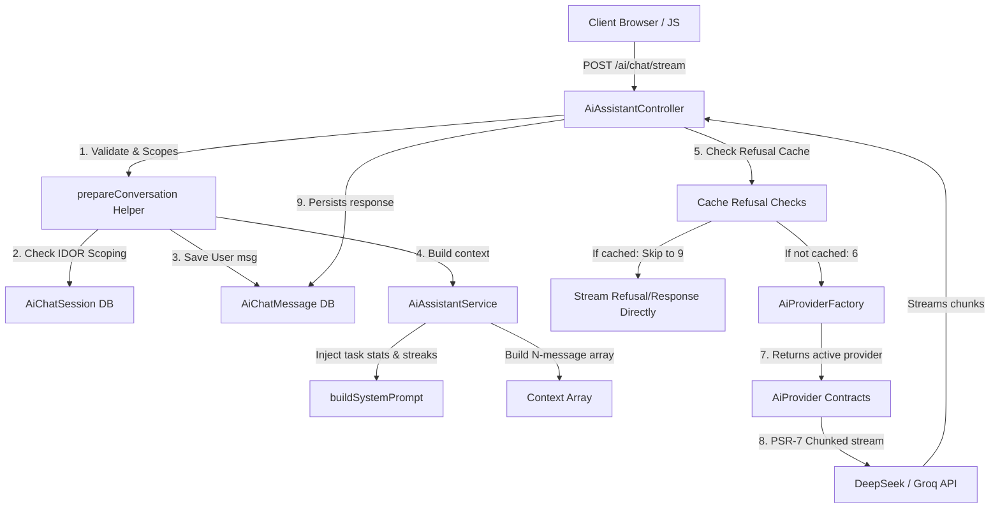

# EaseTask AI Assistant Module Documentation

Welcome to the documentation for the **EaseTask AI Assistant Module**. This guide provides an overview of the frontend UI/UX design and the backend technical architecture powering the AI assistant.

---

## 1. Module Overview
The EaseTask AI Assistant is a productivity-focused AI companion that helps users organize their tasks, track their streaks, review overdue obligations, and receive tailored planning help. 

The assistant has strict scope enforcement rules: it **only** answers queries relating to the user's tasks and productivity. Any off-topic requests (e.g., general coding, general knowledge) are filtered.

---

## 2. Frontend UI/UX Architecture

The frontend consists of two primary user entry points: the **Main Chat View** and the **Floating Action Button (FAB) Widget**. Both share a unified Alpine.js state store and synchronize state dynamically.

### 2.1 Main Chat View (`resources/views/ai/index.blade.php`)
The main interface features a responsive two-column layout: a session-navigating sidebar and a central messaging canvas.

*   **Synchronous New Chat**: Clicking "New Chat" synchronously triggers a `POST` request to create the session in the DB, unshifts it into the local session array, and updates the active ID instantly.
*   **Sidebar Session Navigation**:
    *   **Relative Timestamps**: Each session item displays a relative timestamp (e.g. *"Just now"*, *"2h ago"*, *"Yesterday"*) calculated in JS via `formatRelativeTime(dateStr)`.
    *   **Touch Bubbling**: Selecting or messaging a session touches the DB record, sorting the active session to the top.
    *   **Soft Deletion Confirmations**: Instead of browser-blocking popups, deleting a session toggles an inline *"Delete / Cancel"* state, maintaining a premium feel.
*   **Central Messaging Canvas & Flicker Mitigation**:
    *   **Skeleton Loading Bubbles**: When switching sessions, a set of skeleton bubble elements is animated using opacity keyframes to represent loading states.
    *   **Synchronous Response Title Update**: The first query in a session updates the session's title synchronously *before* the stream begins. The title is returned in the initial response header (`X-Session-Title`), enabling the sidebar to update in-place immediately when the stream starts. This prevents any delayed visual layout flicker.
    *   **Refusal Styling**: Muted, dashed formatting (`.msg-bubble--refusal`) is applied when the assistant returns off-topic refractions.
    *   **Client-Side Off-Topic Nudge**: Tracks off-topic inputs; if consecutive off-topic queries are detected, it intercepts the send attempt and displays an inline suggestion tooltip.
*   **Streaming & Control**:
    *   Uses the browser's `ReadableStream` reader to decode raw text tokens chunk-by-chunk using `TextDecoder`.
    *   **Stop Stream Button**: While generating, the send button is replaced by a Stop button. Clicking it aborts the read stream client-side (`reader.cancel()`).
    *   **Typing locked status**: Disables text inputs and displays a pulsing "Assistant is typing..." dot indicator.

### 2.2 Floating Action Button (FAB) Widget (`resources/views/layouts/app.blade.php`)
Located at the bottom right of the main application layout, the FAB allows users to query the AI assistant from any page in the application.

*   **Shared Session Store**: Shares the active session ID with the main page via `localStorage.getItem('active_ai_session_id')`.
*   **Fallback Sequence**: If local storage is empty, the FAB calls `GET /ai/sessions` and loads the most recently updated session. If the user has no sessions, it initializes in a clean state and implicitly creates the session upon sending the first message.
*   **Tab Synchronization**: Binds to the browser's `storage` event. If a user switches or creates a session in a separate tab (or switches to the main chat page), the FAB updates its messages and session references in real-time.
*   **Capability & Footprint Parity**: 
    *   Features streaming text rendering, stop button, typing dots, and refusal styles.
    *   **Nudges**: Adapted to a smaller inline block warning rendering underneath the input field.
    *   **Skeletons**: Rendered during initial load of session messages when opening the FAB.

---

## 3. Backend Architecture

The backend implements a decoupled, testable, and rate-limited API that handles context building and token conservation.



### 3.1 Routing & Validation (`routes/web.php`)
*   **Routes**:
    *   `GET /ai`: Main chat page.
    *   `GET /ai/sessions`: Lists all chat sessions for the logged-in user.
    *   `GET /ai/sessions/{session}`: Fetches all messages within a specific session.
    *   `POST /ai/sessions`: Creates a new session.
    *   `DELETE /ai/sessions/{session}`: Deletes a session.
    *   `POST /ai/chat/stream`: Streamed chat responses.
*   **Throttling & Middleware**: Protected under `auth` and rate-limited to 30 requests/minute via `throttle:30,1`.

### 3.2 Controller Layer (`app/Http/Controllers/AiAssistantController.php`)
*   **Unified Helper (`prepareConversation`)**:
    *   Validates parameters (`session_id` and `message`).
    *   Fetches sessions scoped to `auth()->id()` to eliminate IDOR risks (returns `404` if session does not exist or isn't owned).
    *   Saves user messages, handles auto-titling, and calls the service layer to build the context.
*   **Context-Scoped Refusal Caching**:
    *   Cache keys are built on the query hash **plus** the user's task context metrics: `session_{$session->id}_refused_{$msgHash}_{$contextHash}`.
    *   `$contextHash` hashes the user's total task count, completed task count, and total points. 
    *   If the user adds or completes tasks, the context hash changes, causing the refusal cache for borderline queries (e.g. "what should I focus on today") to invalidate automatically.
    *   If a query is matched in cache, it bypasses the provider API and returns the refusal response instantly.
*   **Active Stream Caching**:
    *   Sets `session_{$id}_generating` in the Cache for 180 seconds during streaming.
    *   Clears this value on finish/abort/fail. Used by `showSession` to tell the client if a background generation is in progress.
*   **Safe DB Writes (TOCTOU Defense)**:
    *   All streaming background writes are wrapped in `try/catch` blocks for `QueryException`. 
    *   If the user deletes a session mid-stream and the database record is removed before persistence, the database error is intercepted and logged gracefully without crashing the SSE thread.

### 3.3 Service Layer (`app/Services/AiAssistantService.php`)
*   **System Prompt Builder**: Injects real-time user context:
    *   Productivity Stats: Completion rate, completed tasks this week, points.
    *   Streak Stats: Current streak days retrieved from `ProductivityService`.
    *   Task context: Fetches the top 10 most recent pending/overdue tasks with priorities and due dates.
*   **Context Budget Protection**: Truncates historical message counts according to `config('ai.limits.max_context_messages')` (default: 20 turns) to prevent context-window inflation.

### 3.4 Provider Factory & Concrete Classes (`app/Services/Ai/`)
*   **Abstraction**: Pluggable providers implementing `AiProvider` interface:
    ```php
    interface AiProvider {
        public function chat(array $messages): string;
        public function stream(array $messages): \Generator;
    }
    ```
*   **AiProviderFactory**: Resolves active provider from `config('ai.default')` (DeepSeek/OpenCodeGo). Falls back to Groq if API keys are missing.
*   **PSR-7 Stream Processing**: Uses PSR-7 stream resources and `fgets()` buffer parsing to process `data: {...}` lines on-the-fly, yielding tokens incrementally.

